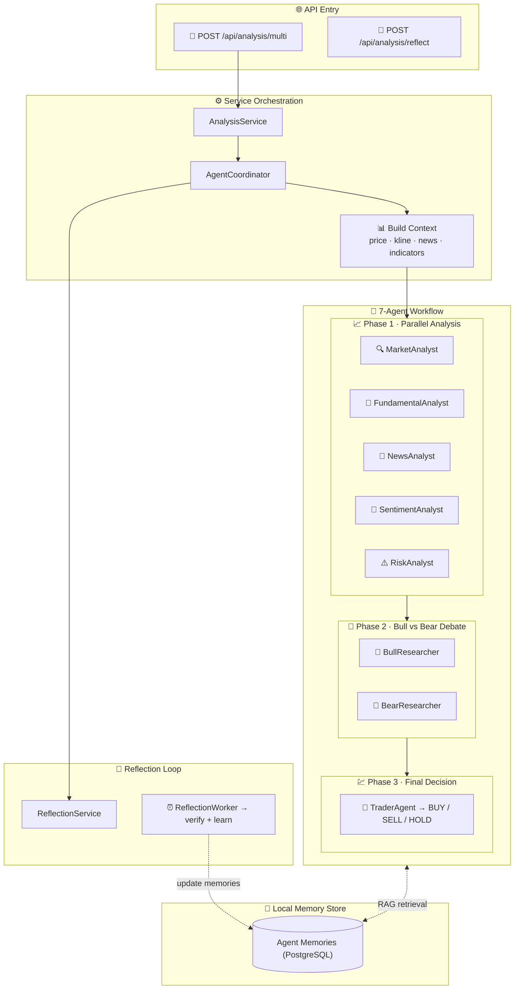

<div align="center">

  <h1>Zing</h1>

  <h3>AI-Native Quantitative Trading Platform</h3>
  <p><strong>Vibe Coding Meets Algo Trading</strong></p>
  <p>

  <p>
    <strong>7 AI Agents · Python Strategies · 10+ Exchanges · Prediction Markets · Your Server, Your Keys</strong>
  </p>
  <p>
    <i>Describe your trading idea in natural language → AI writes the Python strategy → Backtest → Live trade.<br/>
    Zero coding required. Self-hosted — your API keys and strategies never leave your machine.</i>
  </p>

  <p>
    <a href="LICENSE"></a>
    
    
    
    
    
  </p>

  <p>

  </p>

  
</div>

---

## 📑 Table of Contents

- [🚀 Quick Start (2 Minutes)](#-quick-start-2-minutes)
- [🎯 Why Zing?](#-why-zing)
- [📸 Visual Tour](#-visual-tour--watch-video-demo)
- [✨ Key Features](#-key-features)
- [🔌 Supported Exchanges & Brokers](#-supported-exchanges--brokers)
- [🏗️ Architecture & Configuration](#️-architecture--configuration)
- [📚 Documentation Index](#-documentation-index)
- [💼 License & Commercial](#-license--commercial)
- [🤝 Community & Support](#-community--support)

---

## 🚀 Quick Start — Run on localhost (no Docker)

Backend and web run as normal processes. No Docker or Podman required.

```bash
# 1. Clone (use your repo URL)
git clone https://github.com/solankiharsh/marketlabs.git
cd marketlabs

# 2. Backend env (edit DATABASE_URL in server/.env if needed)
make setup

# 3. Run both (creates venv + installs deps on first run)
make dev
```

> **Windows PowerShell**: use `Copy-Item server\env.example -Destination server\.env`

🎉 **Backend** at **http://localhost:5000** · **Web** at **http://localhost:3000**

You need a running PostgreSQL instance and `DATABASE_URL` in `server/.env`. If you prefer to run Postgres in Docker, use `make postgres-up` in another terminal, then `make dev-backend` and `make dev-web`.

**Deploy to Railway:** See [docs/RAILWAY_DEPLOY.md](docs/RAILWAY_DEPLOY.md) for a two-service setup (backend + frontend).

<details>
<summary><b>📝 Key settings in server/.env</b></summary>

```ini
# Required — Change for production!
ADMIN_USER=zing
ADMIN_PASSWORD=your_secure_password
SECRET_KEY=your_random_secret_key

# Optional — Enable AI features (pick one)
OPENROUTER_API_KEY=your_key        # Recommended: 100+ models
OPENAI_API_KEY=your_key            # GPT-4o
DEEPSEEK_API_KEY=your_key          # Cost-effective
GOOGLE_GEMINI_API_KEY=your_key     # Gemini
```

</details>

<details>
<summary><b>🔧 Common Docker Commands</b></summary>

```bash
docker-compose ps                  # View service status
docker-compose logs -f backend     # View backend logs (real-time)
docker-compose restart backend     # Restart backend only
docker-compose up -d --build       # Rebuild & restart all
docker-compose down                # Stop all services
```

**Update to latest version:**
```bash
git pull && docker-compose up -d --build
```

**Backup & Restore database:**
```bash
docker exec zing-db pg_dump -U zing zing > backup.sql
cat backup.sql | docker exec -i zing-db psql -U zing zing
```

**Custom port** — create `.env` in project root:
```ini
BACKEND_PORT=127.0.0.1:5001 # Default: 5000
```

**Optional — run everything in Docker (Postgres + backend in containers):**  
Use `make up` only if you want the full stack in Docker. That command uses whatever your system has as `docker` (often Podman on Mac). If you see "Cannot connect to Podman", either start Docker Desktop or run `podman machine init && podman machine start`. For local dev, **you don’t need Docker**: use `make dev-backend` and `make dev-web` instead.

</details>

---

## 🎯 Why Zing?

> **Vibe Coding for Trading** — Describe your trading idea in plain English (or any language). AI writes the Python strategy, backtests it, and deploys it to live markets. No manual coding. No SaaS lock-in. Everything runs on your own server.

| | |
|---|---|
| 🎵 **Vibe Coding** | Describe ideas in natural language → AI generates production-ready Python strategies |
| 🔒 **100% Self-Hosted** | API keys & strategies never leave your server — privacy by design |
| 🤖 **7 AI Agents** | Multi-agent research team: parallel analysis → debate → trade decision |
| 🐍 **Python-Native** | Full ecosystem (Pandas, NumPy, TA-Lib, scikit-learn) — no proprietary language limits |
| 📊 **Professional Charts** | K-line charts with Python indicators, real-time visualization |
| 🌍 **Crypto + Stocks + Forex** | 10+ exchanges, IBKR, MT5 — all in one platform |
| 📊 **Prediction Markets** | On-demand AI analysis for Polymarket — probability divergence, opportunity scoring |
| 💰 **Monetization-Ready** | Membership, credits, USDT on-chain payment — built-in |
| ⚡ **2-Minute Deploy** | `docker-compose up -d` — production-ready, zero build |

---

## 📸 Visual Tour &nbsp;|&nbsp; [📺 Watch Video Demo](https://youtu.be/HPTVpqL7knM)

<table align="center" width="100%">
  <tr>
    <td colspan="2" align="center">
      <a href="https://youtu.be/HPTVpqL7knM"></a>
    </td>
  </tr>
  <tr>
    <td colspan="2" align="center">
      
      <br/><sub>📊 Professional Quant Dashboard</sub>
    </td>
  </tr>
  <tr>
    <td width="50%" align="center"><br/><sub>🤖 AI Deep Research</sub></td>
    <td width="50%" align="center"><br/><sub>💬 Smart Trading Assistant</sub></td>
  </tr>
  <tr>
    <td align="center"><br/><sub>📈 Indicator Analysis</sub></td>
    <td align="center"><br/><sub>🐍 AI Strategy Coding</sub></td>
  </tr>
  <tr>
    <td colspan="2" align="center"><br/><sub>📊 Portfolio Monitor</sub></td>
  </tr>
</table>

---

## ✨ Key Features

### 🎵 Vibe Coding Strategy Workbench

> **No coding required.** Tell AI what you want in natural language — it generates production-ready Python strategies. Or write your own with the full Python ecosystem (Pandas, NumPy, TA-Lib, scikit-learn). Visualize everything on professional K-line charts.

```
💬 "I want a MACD crossover strategy with RSI filter on BTC 15min"
    ↓ AI generates Python code
    ↓ 📈 Visualize on K-line charts
    ↓ 🔄 Backtest with rich metrics
    ↓ 🤖 AI suggests optimizations
    ↓ 🚀 One-click deploy to live trading
```

### 🤖 7-Agent AI Analysis Engine

> Not just one AI call. Zing deploys **7 specialized agents** that collaborate like a research team — analyze, debate, and reach consensus:

```
Phase 1 (Parallel):  📊 Technical · 📑 Fundamental · 📰 News · 💭 Sentiment · ⚠️ Risk
Phase 2 (Debate):    🐂 Bull vs 🐻 Bear — structured argumentation
Phase 3 (Decision):  🎯 TraderAgent → BUY / SELL / HOLD (with confidence %)
```

- **🎵 Natural Language Analysis** — Ask "Analyze BTC trend for next week" → 7 agents deliver a full report
- **📡 AI Trading Radar** — Auto-scans Crypto/Stocks/Forex hourly, surfaces opportunities
- **⚡ Quick Trade Panel** — See a signal? One-click to execute. No page switching.
- **🧠 Memory-Augmented** — Agents learn from past analyses (local RAG, not cloud)
- **🔌 5+ LLM Providers**: OpenRouter (100+ models), OpenAI, Gemini, DeepSeek, Grok
- **📊 Polymarket Prediction Markets** — On-demand AI analysis for prediction markets. Input a market link or title → AI analyzes probability divergence, opportunity score, and trading recommendations. Full history tracking and billing integration.

### 📈 Full Trading Lifecycle

| Step | What Happens |
|------|-------------|
| **1. 💬 Describe** | Tell AI your trading idea in natural language — or write Python directly |
| **2. 🤖 Generate** | AI creates the indicator & strategy code for you |
| **3. 📊 Visualize** | See signals on professional K-line charts instantly |
| **4. 🔄 Backtest** | Rich metrics + **AI analyzes results & suggests improvements** |
| **5. 🚀 Execute** | Live trade on 10+ crypto exchanges, IBKR (stocks), MT5 (forex) |
| **6. 📡 Monitor** | Portfolio tracker, alerts via Telegram/Discord/Email/SMS/Webhook |

### 📊 Polymarket Prediction Market Analysis

> **On-demand AI analysis for prediction markets.** Input a Polymarket link or market title → AI analyzes probability divergence, opportunity score, and provides trading recommendations.

**Features:**
- **🔍 Smart Search** — Supports market links, slugs, or natural language titles
- **🤖 AI Probability Prediction** — Compares AI-predicted probability vs market probability
- **📈 Opportunity Scoring** — Calculates opportunity score based on divergence and confidence
- **💡 Trading Recommendations** — YES/NO/HOLD with detailed reasoning and key factors
- **📚 History Tracking** — View all your past analyses with full details in a dedicated history tab
- **💰 Billing Integration** — Configurable credit consumption per analysis (set via `BILLING_COST_POLYMARKET_DEEP_ANALYSIS`)
- **🌍 Multi-Language** — AI responses in multiple languages
- **📊 Admin Statistics** — All analyses tracked in user management dashboard

**Usage:**
```
1. Navigate to AI Asset Analysis → Prediction Markets tab
2. Input Polymarket link or market title
3. AI analyzes and returns:
   - Market probability vs AI-predicted probability
   - Divergence analysis
   - Opportunity score (0-100)
   - Trading recommendation (YES/NO/HOLD)
   - Detailed reasoning and key factors
4. View analysis history anytime
```

### 💰 Built-in Monetization

> Most open-source projects need months of custom billing work. Zing ships with a **complete monetization system** out of the box:

- **💳 Membership Plans** — Monthly / Yearly / Lifetime tiers with configurable pricing & credits
- **₿ USDT On-Chain Payment** — TRC20 scan-to-pay, HD Wallet (xpub) per-order addresses, auto-reconciliation via TronGrid
- **🏪 Indicator Marketplace** — Users publish & sell Python indicators, you take commission
- **⚙️ Admin Dashboard** — Order management, AI usage stats, user analytics

### 🔐 Enterprise-Grade Security

- **Multi-User** — PostgreSQL-backed accounts with role-based permissions
- **OAuth** — Google & GitHub one-click login
- **Protection** — Cloudflare Turnstile, IP/account rate limiting, email verification
- **Demo Mode** — Read-only mode for public showcases

<details>
<summary><b>🧠 AI Agent Architecture Diagram (Click to expand)</b></summary>



</details>

---

## 🔌 Supported Exchanges & Brokers

### Cryptocurrency (Direct API Trading)

| Exchange | Markets |
|:--------:|:---------|
| Binance | Spot, Futures, Margin |
| OKX | Spot, Perpetual, Options |
| Bitget | Spot, Futures, Copy Trading |
| Bybit | Spot, Linear Futures |
| Coinbase | Spot |
| Kraken | Spot, Futures |
| KuCoin | Spot, Futures |
| Gate.io | Spot, Futures |
| Bitfinex | Spot, Derivatives |

### Traditional Brokers & Markets

| Market | Broker/Source | Trading |
|--------|--------------|---------|
| **US Stocks** | Interactive Brokers (IBKR), Yahoo Finance, Finnhub | ✅ Via IBKR |
| **Forex** | MetaTrader 5 (MT5), OANDA | ✅ Via MT5 |
| **Futures** | Exchange APIs | ⚡ Data + Notify |

---

## 🏗️ Architecture & Configuration

### Tech Stack

| Layer | Technology |
|-------|-----------|
| **AI Engine** | 7-Agent Multi-Agent System · RAG Memory · 5+ LLM Providers · Vibe Coding (NL→Python) |
| **Backend** | Python 3.10+ · Flask · PostgreSQL 16 · Redis (optional) |
| **Frontend** | Next.js (App Router) · React 18 · Tailwind CSS · shadcn/ui · KLineCharts · Lucide React |
| **Payment** | USDT TRC20 On-Chain · HD Wallet (BIP-32/44) · TronGrid API |
| **Mobile** | Next.js + Capacitor (Android / iOS) |
| **Deploy** | Docker Compose · Nginx · Zero-build one-click |

```text
┌─────────────────────────────────────┐
│         Docker Compose              │
│                                     │
│  ┌───────────────────────────────┐  │
│  │  (API only)                 │  │
│  └──────────────┬────────────────┘  │
│                 │ /api/* proxy       │
│  ┌──────────────▼────────────────┐  │
│  │  backend (Flask)   → :5000   │  │
│  └──────────────┬────────────────┘  │
│  ┌──────────────▼────────────────┐  │
│  │  postgres (PG 16)  → :5432   │  │
│  └───────────────────────────────┘  │
│                                     │
│  External: LLM APIs · Exchanges ·   │
│  TronGrid · Data providers          │
└─────────────────────────────────────┘
```

### Repository Layout

```text
Zing/
├── server/          # 🐍 Backend (Open Source, Apache 2.0)
│   ├── app/routes/              #   API endpoints
│   ├── app/services/            #   Business logic (AI, trading, payment)
│   ├── migrations/init.sql      #   Database schema
│   ├── env.example              #   ⚙️ Config template → copy to .env
│   └── Dockerfile
├── docs/                        # 📚 Guides & tutorials
├── docker-compose.yml           # 🐳 One-click deployment
└── LICENSE                      # Apache 2.0
```

<details>
<summary><b>⚙️ Configuration Reference (.env)</b></summary>

Use `server/env.example` as template:

| Category | Key Variables |
|----------|-----------|
| **Auth** | `SECRET_KEY`, `ADMIN_USER`, `ADMIN_PASSWORD` |
| **Database** | `DATABASE_URL` (PostgreSQL connection string) |
| **AI / LLM** | `LLM_PROVIDER`, `OPENROUTER_API_KEY`, `OPENAI_API_KEY` |
| **OAuth** | `GOOGLE_CLIENT_ID`, `GITHUB_CLIENT_ID` |
| **Security** | `TURNSTILE_SITE_KEY`, `ENABLE_REGISTRATION` |
| **Membership** | `MEMBERSHIP_MONTHLY_PRICE_USD`, `MEMBERSHIP_MONTHLY_CREDITS` |
| **USDT Payment** | `USDT_PAY_ENABLED`, `USDT_TRC20_XPUB`, `TRONGRID_API_KEY` |
| **Proxy** | `PROXY_PORT` or `PROXY_URL` |
| **Workers** | `ENABLE_PENDING_ORDER_WORKER`, `ENABLE_PORTFOLIO_MONITOR` |

</details>

<details>
<summary><b>🔌 API Endpoints</b></summary>

| Endpoint | Description |
|----------|-------------|
| `GET /api/health` | Health check |
| `POST /api/user/login` | User authentication |
| `GET /api/user/info` | Current user info |
| `GET /api/billing/plans` | Membership plans |
| `POST /api/billing/usdt/create-order` | Create USDT payment order |

For the full route list, see `server/app/routes/`.

</details>

---

## 📚 Documentation Index

All detailed guides are in the [`docs/`](docs/) folder:

### Getting Started

| Document | Description |
|----------|-------------|
| [Quick Start](docs/QUICKSTART.md) | Setup and run in 2 minutes |
| [Security Policy](docs/SECURITY.md) | Supported versions, reporting vulnerabilities |
| [Changelog](docs/CHANGELOG.md) | Version history & migration notes |
| [Multi-User Setup](docs/multi-user-setup.md) | PostgreSQL multi-user deployment |

### Strategy Development

| Guide | Link |
|-------|------|
| **Strategy Dev** | [EN](docs/STRATEGY_DEV_GUIDE.md) |
| **Cross-Sectional** | [EN](docs/CROSS_SECTIONAL_STRATEGY_GUIDE_EN.md) |
| **Code Examples** | [examples/](docs/examples/) |

### Broker & Integration

| Guide | Link |
|-------|------|
| **IBKR (US Stocks)** | [Guide](docs/IBKR_TRADING_GUIDE_EN.md) |
| **MT5 (Forex)** | [Guide](docs/MT5_TRADING_GUIDE_EN.md) |
| **OAuth (Google/GitHub)** | [Guide](docs/OAUTH_CONFIG_EN.md) |

### Notifications

| Channel | Setup |
|---------|-------|
| **Telegram** | [Setup](docs/NOTIFICATION_TELEGRAM_CONFIG_EN.md) |
| **Email (SMTP)** | [Setup](docs/NOTIFICATION_EMAIL_CONFIG_EN.md) |
| **SMS (Twilio)** | [Setup](docs/NOTIFICATION_SMS_CONFIG_EN.md) |


---

### 💝 Support the Project

**Crypto Donations (ERC-20 / BEP-20 / Polygon / Arbitrum)**

```
0x96fa4962181bea077f8c7240efe46afbe73641a7
```

<p>
  
  
</p>

---

### Acknowledgements

Built with ❤️ on the shoulders of: [Flask](https://flask.palletsprojects.com/) · [Pandas](https://pandas.pydata.org/) · [CCXT](https://github.com/ccxt/ccxt) · [yfinance](https://github.com/ranaroussi/yfinance) · [Next.js](https://nextjs.org/) · [React](https://react.dev/) · [Tailwind CSS](https://tailwindcss.com/) · [KLineCharts](https://github.com/klinecharts/KLineChart) · [Capacitor](https://capacitorjs.com/) · [bip-utils](https://github.com/ebellocchia/bip_utils)

<p align="center"><sub>If Zing helps you, consider ⭐ starring the repo — it means a lot!</sub></p>
